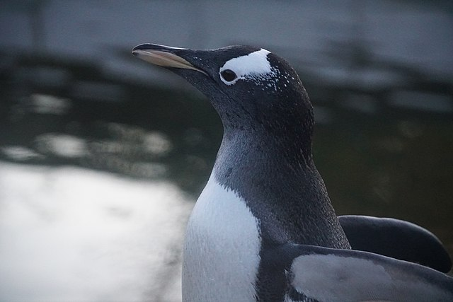

# Biosciences: Statistical Methods

 or

This curriculum module uses biological data to teach fundamental concepts of statistics, data analysis, and data visualization. 

## Description

This module will teach students how to use statistical methods in MATLAB&reg; to analyze ecologically relevant data. We will explore the data using descriptive statistics, fit the data using a predictive model, find the linear correlations between variables, and finally, discuss how to test a hypothesis.Make sure you're familiar with the basics of using MATLAB by going through the [MATLAB Onramp](https://matlabacademy.mathworks.com/details/matlab-onramp/gettingstarted) before continuing. We also recommend reviewing the Biosciences Data module. 

This module utilizes the Palmer penguins [1] dataset, which contains data about three different species of penguin in Antarctica. 

[A Gentoo penguin spreading its flippers](https://commons.wikimedia.org/wiki/File:Gentoo_penguin_in_Edinburgh_Zoo_02.jpg)

## Prerequisites 

This module assumes basic MATLAB knowledge and it is recommended that all students take the  [MATLAB Onramp](https://matlabacademy.mathworks.com/details/matlab-onramp/gettingstarted) and go through the related Biosciences Data curriculum module. 

## Getting Started 

To learn more about opening and using MATLAB, see the accompanying [Getting Started](Getting_Started.pdf) guide. 

## Sections 
Notes: These scripts can all be run independently, though we recommend going through these live scripts in order. These live scripts are intended to be used with output inline. To change the output, go to the View tab of the toolstrip, and select   Output Inline. 
The scripts have areas for the students to interact with the code  . There will also be exercises   in most scripts and the answers will be provided at the end.  A problem set for students to practice these concepts is also included here. Throughout the scripts, there are also moments to students to reflect on what they've learned or on what the data means  . Particularly interesting examples of how these concepts are used in "real-world" biology are also pointed out .

[Introduction](https://matlab.mathworks.com/open/github/v1?repo=MathWorks-Teaching-Resources/biosciences-statistics&file=S1_Introduction.mlx)
- Learning objective: Students learn about why statistical methods are important in biology. 

[Load and clean the data](https://matlab.mathworks.com/open/github/v1?repo=MathWorks-Teaching-Resources/biosciences-statistics&file=S2_Load_clean_data.mlx)
- Learning objective: Students will learn how to clean data and prepare a dataset for analysis.

[Further explore and visualize penguins](https://matlab.mathworks.com/open/github/v1?repo=MathWorks-Teaching-Resources/biosciences-statistics&file=S3_Exploring_data.mlx)
- Learning objective: Students will learn how to use histograms and box plots to understand the distribution of data.

[Descriptive statistics](https://matlab.mathworks.com/open/github/v1?repo=MathWorks-Teaching-Resources/biosciences-statistics&file=S4_Descriptive_stats.mlx)
- Learning objective: Students will learn to calculate and interpret descriptive statistics including mean, median, and standard deviation.

[Predictive modeling](https://matlab.mathworks.com/open/github/v1?repo=MathWorks-Teaching-Resources/biosciences-statistics&file=S5_Predictive_modeling.mlx)
- Learning objective:  Students will learn how to fit linear regression models to data and make predictions about the data.

[Correlations](https://matlab.mathworks.com/open/github/v1?repo=MathWorks-Teaching-Resources/biosciences-statistics&file=S6_Correlations.mlx)
- Learning objective: Students will learn how to calculate and visualize linear correlations between variables. 

[Hypothesis testing](https://matlab.mathworks.com/open/github/v1?repo=MathWorks-Teaching-Resources/biosciences-statistics&file=S7_Hypothesis_testing.mlx)
- Learning objective: Students will learn to create null and alternate hypotheses, test them using t-tests, and interpret p-values. 

[Problem set](https://matlab.mathworks.com/open/github/v1?repo=MathWorks-Teaching-Resources/biosciences-statistics&file=S8_Problem_Set.mlx)
- [Problem set answers](https://matlab.mathworks.com/open/github/v1?repo=MathWorks-Teaching-Resources/biosciences-statistics&file=S9_Problem_set_answers.mlx)

## Related Courseware Modules

Link to 5 other modules here once set up. 

## Products 

MATLAB®, Statistics and Machine Learning Toolbox™, Curve Fitting Toolbox™

## Citations
[1] Horst AM, Hill AP, Gorman KB (2020). palmerpenguins: Palmer Archipelago (Antarctica) penguin data. R package version 0.1.0. https://allisonhorst.github.io/palmerpenguins/. doi:10.5281/zenodo.3960218.

## License

The License for this project is in the [License.txt](license.txt) file in this repository. 

##
_&copy; Copyright 2023 The MathWorks, Inc._
